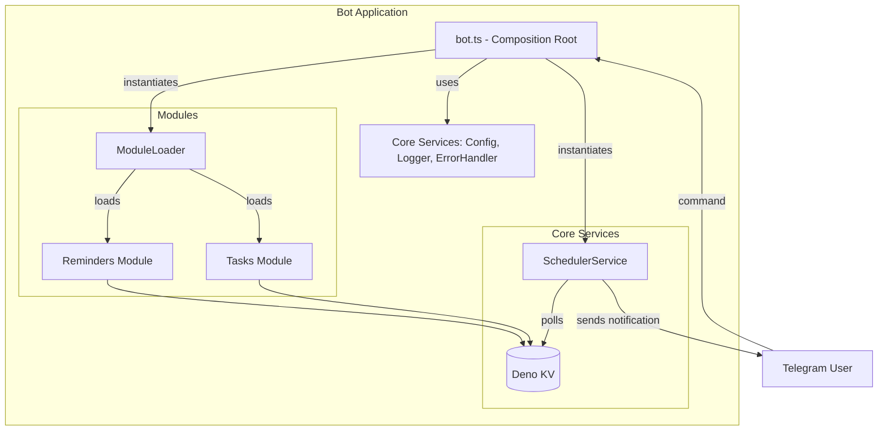
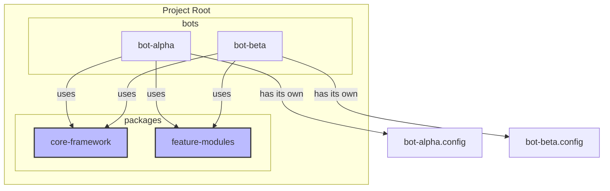

# Design Plan: Production-Grade Multi-Bot Framework

## 1. Executive Summary & Goals

This plan outlines the next steps to evolve the modular Telegram bot into a
production-ready application and to structure the codebase as a reusable
framework for building multiple bots. It continues from the completion of Phase
2 of `plan_google.md`, focusing on reliability, operational maturity, and code
reusability.

**Primary Objective:** Transition from a single-bot project to a robust,
production-grade, multi-bot platform.

**Key Goals:**

1. **Complete the Modular Refactoring:** Finalize the migration of all features
   (specifically "Reminders") to the new modular architecture, eliminating all
   legacy code and establishing a persistent, database-driven scheduler.
2. **Achieve Production Readiness:** Introduce essential non-functional
   components for logging, error handling, configuration management, and
   automated deployment (CI/CD).
3. **Enable Multi-Bot Scalability:** Restructure the project to function as a
   "bot factory," where a shared core and reusable feature modules can be used
   to quickly assemble and deploy new, distinct bot instances.

## 2. Current Situation Analysis

The project has successfully completed Phase 2 of the original plan, resulting
in a well-structured `tasks` module that uses a repository/service pattern with
Deno KV for persistence. This is an excellent foundation.

However, several key areas require attention to meet the new goals:

- **Incomplete Migration:** The "Reminders" feature still relies on the old,
  fragile architecture located in `src/_legacy`. It uses an in-memory scheduler
  (`node-schedule`) and session-based storage, which is not production-ready.
  The `restoreScheduledJobs` script is a temporary fix that needs to be
  replaced.
- **Monolithic Core:** The main `bot.ts` file is still a mix of new module
  loading (`tasksModule`) and legacy command/conversation handlers for
  reminders, preventing it from being a clean "composition root."
- **Missing Scheduler:** The core database-driven scheduler service, planned for
  `src/core/scheduler.ts`, has not been implemented. This is the primary blocker
  to making the "Reminders" feature reliable.
- **Single-Bot Focus:** The current structure is designed for one bot. It lacks
  the abstraction needed to easily launch a second bot that reuses the existing
  `tasks` or `reminders` modules but has a different personality or feature set.

## 3. Proposed Solution / Refactoring Strategy

The strategy is to first complete the original refactoring plan to establish a
solid, production-worthy single bot. Then, we will build upon that foundation to
introduce operational improvements and restructure the project into a multi-bot
framework.

### 3.1. High-Level Design / Architectural Overview

We will evolve the architecture in two stages. First, a fully modular single
bot, and second, a multi-bot monorepo.

**Target Architecture 1: Production-Ready Single Bot**



**Target Architecture 2: Multi-Bot Framework (Monorepo)**



### 3.2. Key Components / Modules

- **`core/scheduler.ts`:** A new, critical service that polls the database for
  pending reminders, sends them, and updates their status. This replaces
  `node-schedule` and the `restoreJobs` script entirely.
- **`core/logger.ts`:** A new utility for structured, leveled logging (INFO,
  WARN, ERROR).
- **`core/bot.ts` (Refactored):** Will contain a `createBot` factory function.
  This function will be responsible for assembling a bot instance from a
  configuration and a list of modules.
- **`packages/` directory:** In the final phase, this will house the shared
  `core-framework` and `feature-modules`.
- **`bots/` directory:** In the final phase, this will contain individual,
  runnable bot applications.

### 3.3. Detailed Action Plan / Phases

---
#### **Phase 3: Implement Reliable Scheduling & Migrate "Reminders" (Continuation)**
*   **Objective(s):** Complete the original refactoring by migrating the reminders feature to be fully persistent and reliable, removing the dependency on in-memory scheduling.
*   **Priority:** High
*   **Task 3.1: Implement the Core Scheduler Service**
    *   **Rationale/Goal:** Create a stateless, database-driven scheduler that is resilient to restarts.
    *   **Estimated Effort:** L
    *   **Deliverable/Criteria for Completion:**
        *   Create `src/core/scheduler.ts`.
        *   Implement a `SchedulerService` class with a `start()` method.
        *   The `start()` method uses `setInterval` (e.g., every 30-60 seconds) to poll Deno KV for reminders that are due (`scheduledAt <= NOW()`) and not yet sent (`isSent === false`).
        *   For each due reminder, it uses `bot.api.sendMessage` to notify the user and then updates the reminder's `isSent` flag to `true` in the database.
        *   The `bot.ts` file is updated to instantiate and start this service.
*   **Task 3.2: Migrate the Reminder Feature to a Module**
    *   **Rationale/Goal:** Refactor the entire "Reminders" feature into the modular architecture, mirroring the structure of the `tasks` module.
    *   **Estimated Effort:** L
    *   **Deliverable/Criteria for Completion:**
        1.  Create `src/modules/reminders/reminders.repository.ts` to handle all Deno KV operations for reminders (CRUD).
        2.  Create `src/modules/reminders/reminders.service.ts`. The `addReminder` method will simply write a reminder record to the database. It will **not** interact with any scheduling library directly.
        3.  Move and refactor all reminder-related handlers and conversations into `src/modules/reminders/`, making them call the new `ReminderService`.
        4.  Create `src/modules/reminders/reminders.module.ts` to register all commands, conversations, and menu items with the bot.
        5.  Update `bot.ts` to load this new module.
*   **Task 3.3: Finalize Reminder Migration**
    *   **Rationale/Goal:** Remove all old code related to reminders.
    *   **Estimated Effort:** S
    *   **Deliverable/Criteria for Completion:**
        *   All legacy reminder handlers and conversation registrations are removed from `bot.ts`.
        *   The `restoreScheduledJobs.ts` file and its call in `bot.ts` are deleted.
        *   The in-memory `jobStore` is deleted.
---

#### **Phase 4: Production Hardening**

- **Objective(s):** Enhance the bot's operational maturity with robust logging,
  error handling, and configuration.
- **Priority:** High

- **Task 4.1: Implement Structured Logging**
  - **Rationale/Goal:** Replace `console.log` with a proper logging utility for
    better monitoring and debugging in a production environment.
  - **Estimated Effort:** M
  - **Deliverable/Criteria for Completion:**
    - Create `src/core/logger.ts` that exports a configured logger instance
      (e.g., using `Deno.log`).
    - The logger should output structured JSON.
    - Replace all `console.log` calls throughout the application with
      appropriate `logger.info`, `logger.warn`, or `logger.error` calls.

- **Task 4.2: Implement Global Error Handling**
  - **Rationale/Goal:** Prevent the bot from crashing on unhandled exceptions
    and provide a centralized way to report errors.
  - **Estimated Effort:** S
  - **Deliverable/Criteria for Completion:**
    - Implement `bot.catch((err) => ...)` in `bot.ts`.
    - The handler should log the full error context using the new logger.
    - Optionally, it can send a notification to an admin chat ID.

- **Task 4.3: Enhance Configuration Management**
  - **Rationale/Goal:** Separate configuration for different environments
    (development, production).
  - **Estimated Effort:** S
  - **Deliverable/Criteria for Completion:**
    - Modify `src/core/config.ts` to support environment-specific variables
      (e.g., `LOG_LEVEL`, `ADMIN_CHAT_ID`).
    - Use `.env` for development defaults and rely on environment variables
      provided by the deployment platform for production.
    - Update `deno.json` to load the `.env` file for the `dev` task.

- **Task 4.4: Define a CI/CD Pipeline**
  - **Rationale/Goal:** Automate testing, linting, and deployment to ensure code
    quality and streamline releases.
  - **Estimated Effort:** M
  - **Deliverable/Criteria for Completion:**
    - Create a `.github/workflows/ci.yml` file (or equivalent for your CI
      provider).
    - The pipeline should run on every push/PR and execute: `deno fmt --check`,
      `deno lint`, and `deno test`.
    - Add a deployment step (e.g., using `deno deploy` CLI) that triggers on
      pushes to the `main` branch.

---
#### **Phase 5: The "Bot Factory" Framework**
*   **Objective(s):** Refactor the project into a monorepo to facilitate the creation and maintenance of multiple bots from a shared codebase.
*   **Priority:** Medium
*   **Task 5.1: Abstract Bot Creation**
    *   **Rationale/Goal:** Decouple the bot's assembly from its execution, creating a reusable factory.
    *   **Estimated Effort:** M
    *   **Deliverable/Criteria for Completion:**
        *   Refactor `src/core/bot.ts` to export a `createBot(config)` function.
        *   This function takes a configuration object (including a list of modules to activate) and returns a fully configured but not-yet-started `Bot` instance.
        *   The main `bot.ts` file will be simplified to: `import { createBot } from './core/bot.ts'; const bot = createBot({ modules: [tasksModule, remindersModule] }); bot.start();`
*   **Task 5.2: Restructure into a Monorepo**
    *   **Rationale/Goal:** Organize the code into shared packages and distinct bot applications.
    *   **Estimated Effort:** L
    *   **Deliverable/Criteria for Completion:**
        *   Create a new root directory structure:
            *   `packages/core/` (contains the framework: `bot.ts`, `config.ts`, `logger.ts`, etc.)
            *   `packages/modules/` (contains feature modules: `tasks/`, `reminders/`)
            *   `bots/my-first-bot/` (contains the runnable application)
        *   Move existing code from `src/` into the new `packages/` directories.
        *   The `bots/my-first-bot/bot.ts` will be the new main entry point, importing from the `packages`.
*   **Task 5.3: Update Tooling for Monorepo**
    *   **Rationale/Goal:** Ensure Deno tasks and import maps work with the new structure.
    *   **Estimated Effort:** S
    *   **Deliverable/Criteria for Completion:**
        *   Update `deno.json` to use `workspaces` to manage the packages.
        *   Adjust import maps to use workspace-relative paths (e.g., `"$core/": "file:///path/to/packages/core/"`).
        *   Update the `dev` task to point to the new entry point: `deno run ... bots/my-first-bot/bot.ts`.
---

### 3.4. Data Model Changes

The `Reminder` data structure needs to be formalized for database storage,
replacing the old session-based model.

**New `Reminder` Interface (in `reminders.types.ts`):**

```typescript
export interface Reminder {
  id: string; // UUID
  userId: number; // The user who created the reminder
  chatId: number; // The chat to send the reminder to
  text: string; // The content of the reminder
  scheduledAt: Date; // The time for the reminder (ISO 8601 string in DB)
  isSent: boolean; // Flag for the scheduler, defaults to false
  createdAt: Date;
}
```

**Deno KV Key Structure:**

- `["reminders_by_user", <user_id>, <reminder_id>]`: Primary storage for the
  reminder object.
- `["reminders_by_time", <iso_timestamp>, <reminder_id>]`: A secondary index to
  allow the scheduler to efficiently query for due reminders without scanning
  all user data. The `ReminderService` will be responsible for creating/deleting
  both records.

## 4. Key Considerations & Risk Mitigation

### 4.1. Technical Risks & Challenges

- **Risk:** The monorepo restructuring (Phase 5) adds complexity.
  - **Mitigation:** Phase 5 is optional. Completing Phases 3 and 4 will already
    result in a highly robust, modular single bot. The monorepo is only
    necessary if building several distinct bots with significant code reuse is a
    firm, near-term requirement.
- **Risk:** The database-polling scheduler might have performance implications
  at a very large scale (millions of reminders).
  - **Mitigation:** For the foreseeable future, a 30-60 second polling interval
    on an indexed Deno KV store is highly efficient. The design allows for this
    scheduler to be moved to a separate process or a more advanced queueing
    system later if needed, without changing the feature modules.

### 4.2. Dependencies

- **Phase 4 (Production Hardening)** depends on the completion of **Phase 3
  (Reminder Migration)** to have a stable, fully modular codebase to work with.
- **Phase 5 (Bot Factory)** is heavily dependent on the bot creation abstraction
  introduced in **Task 5.1**, which itself is a refinement of the work done in
  previous phases.

### 4.3. Non-Functional Requirements (NFRs) Addressed

- **Reliability:** Dramatically improved by replacing the in-memory scheduler
  with a persistent, database-driven one. Global error handling prevents
  crashes.
- **Maintainability:** The final monorepo structure provides maximum separation
  of concerns. Developers can work on the core framework, a feature module, or a
  specific bot application in isolation.
- **Scalability:** The stateless nature of the bot (with state in Deno KV)
  allows for horizontal scaling (running multiple instances). The multi-bot
  framework allows for scaling the _number of products_ you can build and
  maintain.
- **Reusability:** The core principle of Phase 5. Feature modules (`tasks`,
  `reminders`) become plug-and-play components for any new bot.

## 5. Success Metrics / Validation Criteria

- **Zero-Loss Restarts:** A reminder is scheduled, the bot is restarted, and the
  reminder is still delivered at the correct time without any data loss.
- **Clean Composition Root:** The final bot entry point
  (`bots/my-first-bot/bot.ts`) is under 50 lines of code and primarily consists
  of imports, configuration, and calls to `createBot` and `bot.start`.
- **Automated Quality Gates:** Pull requests are automatically blocked by the CI
  pipeline if linting or formatting checks fail.
- **Rapid Bot Scaffolding:** A new, functional "hello world" bot that reuses the
  `tasks` module can be created and running locally in under 30 minutes by
  copying a template and changing its configuration.
- **Effective Monitoring:** Production errors are automatically captured, logged
  in a structured format, and trigger alerts.

## 6. Assumptions Made

- The project will continue to use Deno and Deno KV as the primary technology
  stack.
- The benefits of code reuse across multiple future bots justify the added
  structural complexity of a monorepo.
- Deployment will be on a platform that supports modern Deno and environment
  variable configuration (e.g., Deno Deploy, Fly.io, or a custom VPS setup).

## 7. Open Questions / Areas for Further Investigation

- **Data Migration:** Is there a need to migrate existing reminder data from the
  old file-based sessions to Deno KV? If so, a one-time migration script will
  need to be planned as part of Phase 3.
- **Admin Interface:** Should a simple admin module be created (e.g., to view
  bot stats, list active schedulers, or broadcast messages)? This could be a
  future feature module.
- **Testing Strategy:** What is the strategy for integration testing? While unit
  tests for services/repositories are straightforward, a plan for end-to-end
  testing of conversation flows should be considered.
