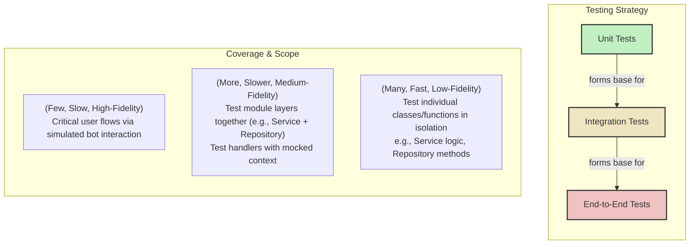

# Test Strategy & Implementation Plan

## 1. Executive Summary & Goals

This document outlines a comprehensive plan for establishing a robust testing
strategy for the Telegram bot. The plan assumes the completion of the
refactoring detailed in `plan_google.md` and `plan_google_2.md`, resulting in a
modular, service-oriented architecture.

The primary objective is to integrate a multi-layered testing approach into the
development lifecycle to ensure code quality, improve application reliability,
and enable developers to add features and refactor with confidence.

### Key Goals:

1. **Establish a Testable Foundation:** Implement the necessary tooling, project
   structure, and conventions to support unit, integration, and end-to-end
   testing.
2. **Maximize Code Quality & Reliability:** Achieve high test coverage for
   critical business logic within the Service and Repository layers,
   significantly reducing the risk of regressions and bugs.
3. **Automate Quality Gates:** Integrate automated testing into a Continuous
   Integration (CI) pipeline, ensuring that all code contributions meet quality
   standards before being merged.

## 2. Current Situation Analysis

The project has been refactored into a highly testable, modular architecture
with a clear separation of concerns (Repository, Service, Handlers). This
structure is ideal for introducing a formal testing strategy.

**Key Strengths:**

- **Decoupled Logic:** Business logic in `Service` classes is decoupled from the
  database (`Repository`) and the Telegram API (`Handlers`), making it perfect
  for unit testing.
- **Well-defined Interfaces:** The interactions between layers are clear,
  simplifying the process of mocking and integration testing.

**Pain Point:**

- **Lack of Tests:** There is currently no automated test suite. This makes it
  risky to modify existing code or add new features, as regressions may go
  unnoticed until they reach production.

## 3. Proposed Solution / Refactoring Strategy

We will adopt the "Testing Pyramid" model, which prioritizes a large base of
fast, simple unit tests, a smaller layer of more complex integration tests, and
a very small number of end-to-end tests for critical user flows.

### 3.1. High-Level Design / Testing Pyramid



### 3.2. Key Components / Tooling & Setup

1. **Test Runner:** We will use Deno's built-in test runner (`deno test`).
2. **Assertions:** We will use the `@std/assert` module from the Deno standard
   library for all assertions.
3. **Mocking:** We will start with **manual stubbing/mocking**. This involves
   creating simple, test-specific implementations of class dependencies (e.g., a
   mock `TaskRepository` for testing `TaskService`). This avoids adding external
   dependencies and is sufficient for the current architecture.
4. **Test Database:** For tests involving repositories, we will use a separate,
   temporary Deno KV database file (e.g., `test.kv.db`). This ensures tests are
   isolated from development data and can be run in a clean state.

### 3.3. Detailed Action Plan / Phases

---
#### **Phase 1: Foundation & Unit Testing**
*   **Objective(s):** Establish the testing environment and create the first layer of fast, reliable unit tests for the application's core logic.
*   **Priority:** High
*   **Task 1.1: Setup Test Environment**
    *   **Rationale/Goal:** Configure the project to recognize and run tests, and establish a clear file structure.
    *   **Estimated Effort:** S
    *   **Deliverable/Criteria for Completion:**
        1.  Update `deno.json` to include a `test` task:
            ```json
            "tasks": {
              "dev": "...",
              "test": "deno test --allow-read --allow-write --allow-net --allow-env --unstable-kv"
            }
            ```
        2.  Create a parallel test file structure. For a file like `src/modules/tasks/tasks.service.ts`, its test file will be `src/modules/tasks/tasks.service.test.ts`.
        3.  Add the test database file (`test.kv.db`) to `.gitignore`.
*   **Task 1.2: Write Unit Tests for Services (e.g., `TaskService`)**
    *   **Rationale/Goal:** Verify the business logic of service classes in complete isolation from the database.
    *   **Estimated Effort:** M
    *   **Deliverable/Criteria for Completion:**
        1.  Create `src/modules/tasks/tasks.service.test.ts`.
        2.  Inside the test file, create a mock `TaskRepository` class that implements the same interface but uses an in-memory array instead of Deno KV.
        3.  Write tests for each method in `TaskService` (e.g., `addTask`, `getTasksList`, `toggleTask`).
        4.  In each test, instantiate the `TaskService` with the mock repository.
        5.  Assert that the service methods return the correct values and that the mock repository was called with the expected arguments.
        6.  Repeat this process for `ReminderService`.
*   **Task 1.3: Write Unit Tests for Repositories (e.g., `TaskRepository`)**
    *   **Rationale/Goal:** Verify that the data access layer correctly interacts with the Deno KV database.
    *   **Estimated Effort:** M
    *   **Deliverable/Criteria for Completion:**
        1.  Create `src/modules/tasks/tasks.repository.test.ts`.
        2.  Use a helper function to open a connection to the test KV database (`test.kv.db`) and clear it before each test run to ensure isolation.
        3.  Write tests for each method in `TaskRepository` (`create`, `findByUser`, `delete`, etc.).
        4.  Each test will perform an action (e.g., `repository.create(...)`) and then use another repository method (e.g., `repository.findById(...)`) to assert that the data was written or modified correctly in the test database.
        5.  Repeat for `ReminderRepository`.
---

#### **Phase 2: Integration Testing**

- **Objective(s):** Test the collaboration between different layers of the
  application to catch errors in their interactions.
- **Priority:** High

- **Task 2.1: Write Integration Tests for Handlers (e.g., `TaskHandlers`)**
  - **Rationale/Goal:** Verify that handlers correctly parse user input from a
    `Context` object and call the appropriate service methods. This tests the
    "glue" code without needing a live bot.
  - **Estimated Effort:** L
  - **Deliverable/Criteria for Completion:**
    1. Create `src/modules/tasks/tasks.handlers.test.ts`.
    2. Create a helper function to generate a mock grammY `MyContext` object.
       This object will simulate a real message (e.g.,
       `{ from: { id: 123 }, message: { text: '/addtask new item' } }`).
    3. For each handler, write a test that:
       - Instantiates the real `TaskService` and `TaskRepository` (using the
         test database).
       - Calls the handler function (e.g., `handlers.addTaskHandler(mockCtx)`).
       - Asserts that the service was called correctly or that the mock
         `ctx.reply` function was called with the expected text.
    4. This pattern is crucial for testing conversations as well, by mocking the
       `conversation` object and its methods like `external` and `waitUntil`.

- **Task 2.2: Write Integration Tests for the Core Scheduler**
  - **Rationale/Goal:** Verify that the `SchedulerService` correctly polls the
    database, identifies due reminders, and attempts to send them.
  - **Estimated Effort:** M
  - **Deliverable/Criteria for Completion:**
    1. Create `src/core/scheduler.test.ts`.
    2. In the test, mock the `bot.api.sendMessage` function to be a simple spy
       that records its calls.
    3. Instantiate the real `ReminderRepository` (with the test DB) and the
       `SchedulerService`.
    4. Add a reminder to the test database that is scheduled for the past.
    5. Manually trigger the scheduler's polling function.
    6. Assert that `bot.api.sendMessage` was called with the correct `chatId`
       and text.
    7. Assert that the reminder's `isSent` flag was updated to `true` in the
       database.

---

#### **Phase 3: CI Integration**

- **Objective(s):** Automate the entire test suite to run on every code change,
  providing rapid feedback and preventing regressions.
- **Priority:** High

- **Task 3.1: Create CI Workflow**
  - **Rationale/Goal:** Define an automated pipeline to enforce code quality
    standards.
  - **Estimated Effort:** M
  - **Deliverable/Criteria for Completion:**
    1. Create a workflow file at `.github/workflows/ci.yml`.
    2. Configure the workflow to trigger on `push` and `pull_request` events to
       the `main` branch.
    3. Define a job with the following steps:
       - Check out the code.
       - Set up Deno.
       - Run `deno fmt --check` to verify code formatting.
       - Run `deno lint` to check for code style issues.
       - Run `deno task test` to execute the entire test suite.
    4. The workflow must pass for a pull request to be mergeable.

## 4. Key Considerations & Risk Mitigation

- **Test Data Management:** Tests that interact with the database must be
  idempotent and clean up after themselves. The `beforeEach`/`afterEach` hooks
  in `Deno.test` should be used to manage the state of the test KV database.
- **Mocking grammY Context:** Creating mock `Context` and `Conversation` objects
  can be complex. We should create a shared `test/helpers.ts` file to contain
  factory functions for these mocks to ensure consistency and reduce
  boilerplate.
- **E2E Testing:** True E2E testing (communicating with a live Telegram bot) is
  complex and can be flaky. We will defer this until the unit and integration
  test suites are mature. The handler integration tests (Task 2.1) provide 90%
  of the benefit with 10% of the effort.

## 5. Success Metrics / Validation Criteria

- **Test Coverage:** Achieve and maintain a test coverage of >80% for all files
  in `src/modules/*/services/` and `src/modules/*/repositories/`.
- **CI Pipeline Health:** The CI pipeline successfully runs on 100% of pull
  requests to `main` and consistently blocks PRs that fail linting, formatting,
  or tests.
- **Bug Reduction:** A noticeable decrease in regressions and bugs for features
  that have comprehensive test coverage.
- **Developer Confidence:** The development team feels confident in refactoring
  code and adding new features, knowing that the test suite will catch most
  issues.

## 6. Assumptions Made

- The project's architecture is fully migrated as per `plan_google.md` and
  `plan_google_2.md`.
- The team is committed to writing and maintaining tests as part of the
  development process.
- GitHub Actions is the chosen CI/CD platform.

## 7. Open Questions / Areas for Further Investigation

- What is the team's initial target for code coverage?
- Are there any particularly complex conversation flows that might require a
  more sophisticated testing approach than manual context mocking?
- Once the foundation is solid, which critical user journey should be
  prioritized for a true (but simple) E2E test? (e.g., `/start` -> `menu` ->
  `addtask`).
