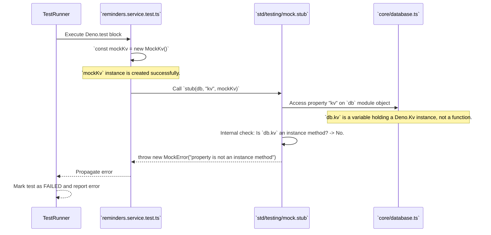

# Bug Analysis Report: Test Failures Due to `MockError: property is not an instance method`

## 1. Executive Summary

The test failures in `ReminderService` and `TaskService` are caused by the
incorrect use of the `stub` function from `deno.land/std/testing/mock`. The
`stub` function is designed to replace methods on an object instance or class
prototype. In the failing tests, it is being used to mock `kv`, which is a
module-level variable exported from `src/core/database.ts`, not a method. This
misuse triggers an internal validation within the `stub` function, leading to
the `MockError: property is not an instance method` and causing the tests to
fail at setup.

The key code areas involved are:

- `src/modules/reminders/reminders.service.test.ts`
- `src/modules/tasks/tasks.service.test.ts`
- `src/core/database.ts`

The recommended solution is to stop using `stub` for this purpose and instead
leverage the fact that `kv` is an exported `let` variable, allowing for direct
reassignment within the test scope.

## 2. Bug Description and Context (from `User Task`)

- **Observed Behavior:** When running `deno task test`, the test suites for
  `ReminderService` and `TaskService` fail immediately.
- **Expected Behavior:** The test suites for `ReminderService` and `TaskService`
  should execute successfully, using the provided `MockKv` for database
  isolation.
- **Steps to Reproduce (STR):**
  1. Execute the command `deno task test`.
- **Environment (if provided):** Deno
- **Error Messages (if any):**
  ```
  ERRORS

  ReminderService => ./src/modules/reminders/reminders.service.test.ts:11:6
  error: MockError: property is not an instance method
      throw new MockError("property is not an instance method");
            ^
      at stub (https://deno.land/std@0.224.0/testing/mock.ts:788:11)
      at file:///.../src/modules/reminders/reminders.service.test.ts:16:20

  TaskService => ./src/modules/tasks/tasks.service.test.ts:11:6
  error: MockError: property is not an instance method
      throw new MockError("property is not an instance method");
            ^
      at stub (https://deno.land/std@0.224.0/testing/mock.ts:788:11)
      at file:///.../src/modules/tasks/tasks.service.test.ts:16:20
  ```

## 3. Code Execution Path Analysis

### 3.1. Entry Point(s) and Initial State

The execution begins when the Deno test runner attempts to run the test suites
defined in `reminders.service.test.ts` and `tasks.service.test.ts`. Before any
test steps (`t.step`) are executed, the initial setup code within the
`Deno.test` block is run.

### 3.2. Key Functions/Modules/Components in the Execution Path

- **`deno task test`:** The entry command that initiates the test runner.
- **`reminders.service.test.ts` / `tasks.service.test.ts`:** The test files
  containing the failing logic.
- **`stub()` from `deno.land/std/testing/mock.ts`:** The mocking utility being
  used.
- **`db` module (`src/core/database.ts`):** The module whose exported `kv`
  variable is the target of the mock attempt.

### 3.3. Execution Flow Tracing

The execution flow is identical for both failing test files.



- **Step 1:** The test runner starts the `ReminderService` test suite.
- **Step 2:** Inside the test setup,
  `const dbStub = stub(db, "kv", mockKv as any);` is executed.
- **Step 3:** The `stub` function receives the imported `db` module object and
  the property name `"kv"`.
- **Step 4:** `stub` inspects the property `db.kv`. It finds an object (the Deno
  KV instance), not a function/method.
- **Step 5:** The internal validation of `stub` fails because it is designed to
  replace methods, not arbitrary properties or variables. It throws the
  `MockError`.
- **Step 6:** The error is not caught, causing the entire test suite to fail.
  The same process repeats for `TaskService`.

### 3.4. Data State and Flow Analysis

The issue occurs before any data manipulation logic is tested. It is a failure
in the test setup/instrumentation phase. The state of `mockKv.store` is
irrelevant as the error happens before the mock is successfully injected.

## 4. Potential Root Causes and Hypotheses

### 4.1. Hypothesis 1: Incorrect Usage of `stub` Function

This is the definitive root cause. The `stub` function is being applied to a
target that it does not support.

- **Rationale/Evidence:** The error message
  `MockError: property is not an instance method` is explicit. It clearly states
  that the target property (`kv`) is not the expected type (an instance method).
  The `stub` function is part of a testing library and has a specific contract,
  which is being violated.

- **Code (if relevant):** The conflict is between how `kv` is defined and how
  it's being mocked.

  **Definition in `src/core/database.ts`:**
  ```typescript
  // kv is a module-level variable, exported as 'let'
  export let kv = await Deno.openKv("./sessions/kv.db");
  ```

  **Usage in `src/modules/reminders/reminders.service.test.ts:16`:**
  ```typescript
  // stub is used here, expecting 'kv' to be a method on the 'db' object.
  const dbStub = stub(db, "kv", mockKv as any);
  ```

- **How it leads to the bug:** The `stub` function is not a general-purpose
  monkey-patching tool. It is specifically for replacing methods on an object
  for the duration of a test, allowing for spying and restoration. When it's
  given a non-method property, it throws an error to prevent incorrect usage and
  silent failures.

### 4.2. Most Likely Cause(s)

Hypothesis 1 is confirmed as the sole cause of the failure.

## 5. Supporting Evidence from Code

- **`src/core/database.ts:5`:** `export let kv = await Deno.openKv(...)` defines
  `kv` as a re-assignable module-level variable.
- **`src/modules/reminders/reminders.service.test.ts:16`:**
  `const dbStub = stub(db, "kv", mockKv as any);` is the incorrect application
  of `stub`.
- **`src/modules/tasks/tasks.service.test.ts:16`:**
  `const dbStub = stub(db, "kv", mockKv as any);` is the identical error in the
  other test file.

## 6. Recommended Steps for Debugging and Verification

The fix is to replace the incorrect `stub` call with a direct assignment, which
is possible because `kv` is exported as a `let`. This should be done within a
`try...finally` block to ensure the original `kv` instance is restored after the
test, guaranteeing test isolation.

**1. Modify `src/modules/reminders/reminders.service.test.ts`:**

Replace the `stub` logic with direct assignment.

**Current Code:**

```typescript
Deno.test(
  "ReminderService",
  { sanitizeResources: false, sanitizeOps: false },
  async (t) => {
    const mockKv = new MockKv();
    const dbStub = stub(db, "kv", mockKv as any); // FAILS HERE

    // ... test steps ...

    dbStub.restore();
  },
);
```

**Recommended Correction:**

```typescript
import { ReminderService } from "./reminders.service.ts";
import { ReminderRepository } from "./reminders.repository.ts";
import * as db from "../../core/database.ts"; // Ensure db is imported
import { MockKv } from "../../../test/mocks/kv.mock.ts";
// ... other imports

Deno.test(
  "ReminderService",
  { sanitizeResources: false, sanitizeOps: false },
  async (t) => {
    const originalKv = db.kv; // 1. Store the original
    const mockKv = new MockKv();
    db.kv = mockKv as any; // 2. Directly assign the mock

    try {
      const reminderRepository = new ReminderRepository();
      const service = new ReminderService(reminderRepository);
      const userId = 1;

      // ... all your t.step(...) calls go here ...
    } finally {
      db.kv = originalKv; // 3. Restore the original in a finally block
    }
  },
);
```

**2. Modify `src/modules/tasks/tasks.service.test.ts`:**

Apply the exact same pattern to this file.

**Recommended Correction:**

```typescript
import { TaskService } from "./tasks.service.ts";
import { TaskRepository } from "./tasks.repository.ts";
import * as db from "../../core/database.ts"; // Ensure db is imported
import { MockKv } from "../../../test/mocks/kv.mock.ts";
// ... other imports

Deno.test(
  "TaskService",
  { sanitizeResources: false, sanitizeOps: false },
  async (t) => {
    const originalKv = db.kv; // 1. Store the original
    const mockKv = new MockKv();
    db.kv = mockKv as any; // 2. Directly assign the mock

    try {
      const taskRepository = new TaskRepository();
      const service = new TaskService(taskRepository);
      const userId = 1;

      // ... all your t.step(...) calls go here ...
    } finally {
      db.kv = originalKv; // 3. Restore the original in a finally block
    }
  },
);
```

## 7. Bug Impact Assessment

**High.** This bug completely blocks the execution of all service-level unit
tests. This is a critical failure as it prevents the validation of business
logic in isolation, which was a primary goal of the testing refactor
(`plan_google_tests2_2.md`). Without these tests, developer confidence is
reduced, and the risk of regressions is significantly higher.

## 8. Assumptions Made During Analysis

- The `kv` variable in `src/core/database.ts` was intentionally declared with
  `let` to allow for re-assignment, making it suitable for this mocking pattern.
- The `deno.land/std/testing/mock.stub` function's behavior is consistent with
  its documentation and error messages, i.e., it is for methods only.

## 9. Open Questions / Areas for Further Investigation

There are no open questions. The cause is clear, and the solution is
straightforward. The implementation of the fix should resolve the reported
errors.
