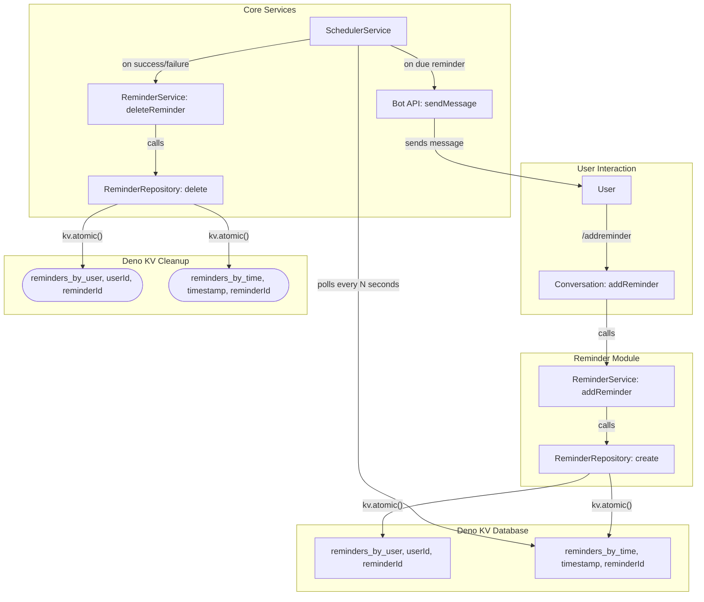

# Refactoring Plan: High-Performance Reminder System

## 1. Executive Summary & Goals

This document outlines a targeted refactoring plan for the bot's reminder
functionality. The primary objective is to re-architect the underlying
scheduling mechanism to be highly performant and scalable, capable of handling
hundreds of thousands of reminders without degradation. The plan strictly
adheres to the existing project structure, enhancing the current implementation
rather than replacing it.

### Key Goals:

1. **Scalable Scheduling:** Replace the inefficient, full-scan scheduling loop
   with a high-performance, index-based query system that scales efficiently to
   200,000+ reminders.
2. **Enhanced Reliability & Data Integrity:** Implement atomic database
   operations for creating and deleting reminders to ensure data consistency.
   Ensure reminders are correctly and permanently deleted after being sent or
   cancelled by the user.
3. **Improve Maintainability:** Refine the service layer and data flow to be
   more robust and lay the foundation for future logging and testing
   integration, without altering the established modular architecture.

## 2. Current Situation Analysis

The existing application benefits from a good modular architecture, with
features like `reminders` and `tasks` cleanly separated. It correctly uses Deno
KV for data persistence, which is a solid foundation.

However, the current implementation of the reminder system has critical
limitations that prevent it from meeting the specified performance and
reliability requirements:

- **Scheduler Performance Bottleneck:** The `SchedulerService` in
  `src/core/scheduler.ts` polls the database by iterating over every single
  reminder for every user (`kv.list({ prefix: ["reminders_by_user"] })`). With
  200,000 reminders, this full-scan operation every 30 seconds is extremely
  inefficient and will lead to high CPU usage and significant delays in sending
  notifications.
- **Inefficient Data Cleanup:** Sent reminders are marked as
  `reminderIsActive: false` but are not deleted from the database. This causes
  the dataset to grow indefinitely, exacerbating the scheduler's performance
  problem over time.
- **Fragile Deletion Logic:** The `ReminderService.deleteReminder` method
  operates on a numeric `index` from a list. This is less robust than operating
  on a unique `reminderId`, as it relies on a freshly fetched list and can be
  prone to race conditions or errors if the list changes.

## 3. Proposed Solution / Refactoring Strategy

The core of the strategy is to introduce a time-based secondary index within
Deno KV. This allows the scheduler to query for _only_ due reminders,
eliminating the need to scan the entire database.

### 3.1. High-Level Design / Architectural Overview

We will maintain the existing service/repository pattern but enhance it to
support a more efficient data structure. When a reminder is created, it will be
written to two locations within Deno KV in a single atomic transaction.



This diagram illustrates that creating a reminder writes to two indices, and the
scheduler efficiently reads from the time-based index before triggering a full
cleanup of both entries.

### 3.2. Key Components / Modules

The changes will be localized to the `reminders` module and the core
`scheduler`.

- **`src/modules/reminders/reminders.repository.ts`**:
  - The `create` method will be updated to perform an atomic write to both the
    user index and the new time index.
  - The `delete` method will be updated to perform an atomic deletion from both
    indices.
- **`src/modules/reminders/reminders.service.ts`**:
  - The `deleteReminder` method will be refactored to accept a unique
    `reminderId` for improved robustness.
- **`src/modules/reminders/reminders.conversations.ts`**:
  - The `deleteReminderConversation` will be slightly modified to map the user's
    numeric input to a `reminderId` before calling the service.
- **`src/core/scheduler.ts`**:
  - The `checkAndSendReminders` method will be completely rewritten to query the
    `reminders_by_time` index for due items, making the operation fast and
    scalable. After processing, it will call the repository to delete the
    reminder.
- **`src/modules/reminders/reminders.types.ts`**:
  - The `reminderIsActive` property will be removed as it becomes redundant.
    Reminders will either exist in the DB (active) or not (sent/deleted).

### 3.3. Detailed Action Plan / Phases

#### Phase 1: Data Model and Repository Refactoring

- **Objective(s):** Update the data access layer to support the new, efficient
  indexing strategy.
- **Priority:** High

- **Task 1.1: Update Reminder Type**
  - **Rationale/Goal:** Simplify the data model by removing the now-obsolete
    `reminderIsActive` flag.
  - **Estimated Effort:** S
  - **Deliverable/Criteria for Completion:** The `Reminder` interface in
    `src/modules/reminders/reminders.types.ts` no longer contains the
    `reminderIsActive` property. All related logic is removed from the
    repository and service.

- **Task 1.2: Refactor `ReminderRepository.create`**
  - **Rationale/Goal:** Implement the dual-index write atomically to ensure data
    consistency.
  - **Estimated Effort:** M
  - **Deliverable/Criteria for Completion:** The `create` method uses
    `kv.atomic()` to set two keys: `["reminders_by_user", userId, reminderId]`
    and `["reminders_by_time", timestamp, reminderId]`. The value for the
    time-index key can be minimal (e.g., `{ userId, reminderId }`) to save
    space.

- **Task 1.3: Refactor `ReminderRepository.delete`**
  - **Rationale/Goal:** Ensure reminders are completely removed from the system
    from both indices.
  - **Estimated Effort:** M
  - **Deliverable/Criteria for Completion:** The `delete` method first fetches
    the full reminder to get its `reminderDate` (to construct the time-key),
    then uses `kv.atomic()` to delete both the user-key and the time-key.

- **Task 1.4: Refactor `deleteReminder` Flow**
  - **Rationale/Goal:** Make the deletion logic more robust by using unique IDs
    instead of array indices.
  - **Estimated Effort:** M
  - **Deliverable/Criteria for Completion:**
    1. `ReminderService.deleteReminder` signature is changed to
       `(reminderUserId: number, reminderId: string)`.
    2. `reminders.conversations.ts` is updated. When listing reminders for
       deletion, it fetches the full reminder objects, displays the text to the
       user, and internally maps the user's numeric choice (`1`, `2`, etc.) to
       the corresponding `reminderId` to pass to the service.

#### Phase 2: High-Performance Scheduler Implementation

- **Objective(s):** Replace the inefficient polling loop with a scalable,
  index-based query.
- **Priority:** High

- **Task 2.1: Rewrite `SchedulerService.checkAndSendReminders`**
  - **Rationale/Goal:** Implement the core logic for the high-performance
    scheduler.
  - **Estimated Effort:** L
  - **Deliverable/Criteria for Completion:**
    1. The method gets the current time as an ISO string
       (`new Date().toISOString()`).
    2. It uses
       `kv.list({ prefix: ["reminders_by_time"], end: ["reminders_by_time", now_iso_string] })`
       to get an iterator of only due reminders.
    3. It iterates through the due reminders, sends the notification via
       `bot.api.sendMessage`, and calls `reminderRepository.delete` for each
       one.

- **Task 2.2: Implement Error Handling in Scheduler**
  - **Rationale/Goal:** Decide how to handle cases where the Telegram API fails
    to send a message.
  - **Estimated Effort:** S
  - **Deliverable/Criteria for Completion:** A `try...catch` block is wrapped
    around the `bot.api.sendMessage` call. On failure (e.g., user blocked the
    bot), the error is logged, and the reminder is deleted from the database to
    prevent repeated failed attempts.

- **Task 2.3: Adjust Polling Interval**
  - **Rationale/Goal:** With a highly efficient query, the polling can be more
    frequent for better precision.
  - **Estimated Effort:** S
  - **Deliverable/Criteria for Completion:** In `src/core/app.ts`, the
    `schedulerService.run()` interval is reduced from `30000` to a more
    appropriate value like `5000` (5 seconds).

#### Phase 3: Foundational Improvements

- **Objective(s):** Introduce logging to improve observability and prepare for
  future testing.
- **Priority:** Medium

- **Task 3.1: Introduce a Core Logger**
  - **Rationale/Goal:** Establish a centralized, extensible logging pattern.
  - **Estimated Effort:** S
  - **Deliverable/Criteria for Completion:** A new file `src/core/logger.ts` is
    created. It can export a simple logger instance (e.g., using Deno's standard
    `log` library or a basic class wrapper around `console`).

- **Task 3.2: Integrate Logger into Services**
  - **Rationale/Goal:** Use the new logger in critical components for better
    debugging and monitoring.
  - **Estimated Effort:** M
  - **Deliverable/Criteria for Completion:** `SchedulerService` and
    `ReminderService` are updated to accept a logger instance in their
    constructors and use it to log key events (e.g., "Sending reminder X",
    "Failed to send reminder Y", "Scheduler poll complete").

### 3.4. Data Model Changes

The primary change is the introduction of a new key structure in Deno KV and the
simplification of the `Reminder` type.

**Deno KV Key Structure:**

1. **User-Facing Index:**
   `["reminders_by_user", <userId: number>, <reminderId: string>]` -> `Reminder`
   object.
   - Used for listing reminders for a specific user (`/reminders`).
2. **Scheduler Index:**
   `["reminders_by_time", <timestamp: string>, <reminderId: string>]` ->
   `{ userId: number, reminderId: string }`
   - `timestamp` is the `reminderDate` in ISO 8601 format (e.g.,
     `2024-12-31T23:59:59.000Z`). This format is lexicographically sortable.
   - Used by the scheduler for efficient range queries.

**Updated `Reminder` Interface (`src/modules/reminders/reminders.types.ts`):**

```typescript
export interface Reminder {
  reminderString: string;
  reminderDate: Date;
  reminderToDateString: string;
  // reminderIsActive: boolean; // This field is REMOVED
  reminderId: string;
  reminderUserId: number;
  createdAt: Date;
}
```

### 3.5. API Design / Interface Changes

The only internal signature change is within the service layer, which improves
decoupling.

- **`ReminderService.deleteReminder`**:
  - **Old:**
    `deleteReminder(reminderUserId: number, index: number): Promise<Reminder | null>`
  - **New:**
    `deleteReminder(reminderUserId: number, reminderId: string): Promise<Reminder | null>`

## 4. Key Considerations & Risk Mitigation

### 4.1. Technical Risks & Challenges

- **Risk:** Data inconsistency if atomic operations fail or are implemented
  incorrectly.
  - **Mitigation:** Strictly use `kv.atomic()` for all operations that modify
    both indices. The implementation must be carefully tested to ensure both
    keys are created and deleted together.
- **Risk:** Existing reminders in the database will not have the new time-based
  index.
  - **Mitigation:** A one-time migration script should be written and executed
    during deployment. This script will iterate through all existing
    `reminders_by_user` entries, read their `reminderDate`, and create the
    corresponding `reminders_by_time` entry.

### 4.2. Dependencies

- The scheduler refactoring (Phase 2) is fully dependent on the completion of
  the repository and data model changes (Phase 1).
- The logging integration (Phase 3) can be done in parallel but is best done
  after the core logic is refactored.

### 4.3. Non-Functional Requirements (NFRs) Addressed

- **Performance & Scalability:** The new scheduler design provides O(log N + K)
  performance (where K is the number of due items) instead of O(N), making it
  extremely fast and scalable.
- **Reliability:** Atomic operations prevent partial data writes/deletes.
  Deleting reminders after sending ensures the system is self-cleaning and
  reliable.
- **Maintainability:** The logic is more robust and easier to reason about.
  Introducing a logger improves observability. The changes are contained within
  the existing architecture, respecting its design.
- **Persistence:** The use of Deno KV is maintained, ensuring all reminders
  survive restarts.

## 5. Success Metrics / Validation Criteria

- **Performance:** The `checkAndSendReminders` function execution time remains
  constant (< 50ms) regardless of whether there are 100 or 200,000 reminders in
  the database.
- **Correctness:** A scheduled reminder is sent within a reasonable margin of
  its due time (e.g., +/- the scheduler interval). After being sent, it is
  verifiably deleted from both Deno KV indices.
- **Reliability:** A user-deleted reminder is never sent. The bot can be
  restarted, and all pending reminders are processed correctly without any loss.

## 6. Assumptions Made

- A brief period of downtime for deploying the changes and running a one-time
  data migration script is acceptable.
- The precision of the scheduler (e.g., every 5 seconds) is sufficient for the
  bot's use case.
- Deno KV's performance characteristics for lexicographical range scans on
  string keys are adequate for this task (which they are).

## 7. Open Questions / Areas for Further Investigation

- **Error Handling Strategy:** The plan proposes deleting a reminder if sending
  fails (e.g., user blocked the bot). Should there be a retry mechanism with
  exponential backoff for transient network errors? For this scope, simple
  deletion is sufficient, but this could be a future enhancement.
- **Data Migration:** The plan assumes a migration script will be written. The
  exact implementation of this script needs to be detailed as a separate, small
  task. It will involve listing all keys with the old prefix and creating new
  entries.
