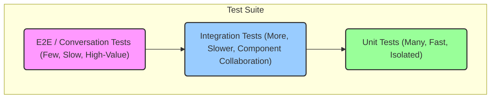

# Refactoring Plan: Comprehensive Bot Testing Strategy

## 1. Executive Summary & Goals

This plan outlines a strategy to elevate the bot's testing suite from its
current state to a comprehensive, multi-layered system. The primary objective is
to ensure that passing tests provide high confidence in the application's
stability and correctness, making it "release-ready" at any time.

The key goals are:

1. **Establish a Robust Testing Pyramid:** Implement and distinguish between
   Unit, Integration, and End-to-End (E2E) tests to improve test speed,
   reliability, and focus.
2. **Achieve High Test Coverage:** Systematically increase test coverage to over
   80% for all critical business logic, especially in the `tasks` and
   `reminders` modules.
3. **Eliminate Critical Testing Gaps:** Create tests for currently uncovered
   areas, including stateful conversations, core application setup, and
   placeholder modules.

## 2. Current Situation Analysis

The project has a good modular structure, with tests co-located with the code
they test. Foundational tests exist for the `tasks` and `reminders` modules,
primarily at the service and repository layers.

However, several key pain points and limitations compromise the goal of a
release-ready test suite:

- **Inconsistent Test Types:** Most existing tests are effectively integration
  tests as they rely on a real Deno KV database instance. This blurs the line
  between unit and integration testing, making tests slower and potentially less
  reliable.
- **Major Coverage Gaps:** There is a complete lack of tests for:
  - Stateful conversation flows (`*.conversations.ts`). This is the highest-risk
    area, as these flows contain complex user interaction logic.
  - Core application setup (`src/core/app.ts`), including command and module
    registration.
  - Entire feature modules: `currencies`, `quote`, `settings`, `translate`, and
    `weather`.
- **Suboptimal Testing Practices:**
  - **Testing Private Methods:** `scheduler.test.ts` uses `@ts-ignore` to test a
    private method, which is an anti-pattern. Tests should validate a
    component's public contract.
  - **Brittle Mocks:** The `test/helpers.ts` file, while a good start, creates
    complex mock objects with type assertions (`as unknown as ...`) that can be
    fragile.
- **Lack of End-to-End Validation:** No tests exist to simulate a full user
  journey, such as a user starting an `/addreminder` command and completing the
  entire conversation.
- **Basic CI Pipeline:** The current CI setup in `.github/workflows/ci.yml` runs
  tests but lacks crucial steps like code linting (commented out) and test
  coverage analysis.

## 3. Proposed Solution / Refactoring Strategy

### 3.1. High-Level Design / Architectural Overview

We will adopt the "Testing Pyramid" model to structure our tests. This approach
ensures we have a large base of fast, isolated unit tests, a smaller layer of
integration tests, and a few high-value E2E tests.

- **Unit Tests:** Test a single class or function in complete isolation. All
  external dependencies (Deno KV, grammY API) will be mocked. These will be the
  fastest and most numerous tests.
- **Integration Tests:** Test the interaction between a few components, for
  example, a `Service` with its `Repository` and a _real test database_. These
  verify that our components are wired together correctly.
- **E2E (Conversation) Tests:** Test a complete feature from the user's
  perspective. These will simulate user input and verify the bot's responses
  throughout a conversation flow.

### 3.2. Key Components / Modules

- **`test/` Directory:** This will be enhanced with more robust helpers.
  - `test/helpers.ts`: Refactor to provide more type-safe and reusable mocks for
    `MyContext`.
  - `test/mocks/kv.mock.ts`: A new file containing an in-memory mock
    implementation of the `Deno.Kv` interface for use in unit tests.
- **CI Pipeline (`.github/workflows/ci.yml`):** Will be updated to include
  linting, coverage reporting, and potentially separate jobs for different test
  types.

### 3.3. Detailed Action Plan / Phases

#### Phase 1: Foundation & Critical Path Hardening

- **Objective(s):** Establish a solid testing foundation and cover the most
  critical existing features with the new testing pyramid structure.
- **Priority:** High

- **Task 1.1: Enhance Test Infrastructure**
  - **Rationale/Goal:** Create the necessary tools for writing effective,
    isolated unit tests.
  - **Estimated Effort:** M
  - **Deliverable/Criteria for Completion:**
    - A new `test/mocks/kv.mock.ts` file is created with an in-memory `Deno.Kv`
      mock.
    - `test/helpers.ts` is refactored to produce more reliable mock contexts.
    - The `clearDb` function is moved into a dedicated helper for integration
      tests.

- **Task 1.2: Refactor Repository & Service Tests**
  - **Rationale/Goal:** Align existing tests with the new pyramid structure.
  - **Estimated Effort:** M
  - **Deliverable/Criteria for Completion:**
    - `*.repository.test.ts` files are clearly marked as integration tests and
      continue to use a real test DB.
    - `*.service.test.ts` files are refactored into true unit tests, using the
      new mock KV from Task 1.1 instead of a `MockReminderRepository`. This
      tests the service's logic in isolation.

- **Task 1.3: Introduce E2E Conversation Tests**
  - **Rationale/Goal:** Address the most significant testing gap by creating the
    first E2E test for a stateful conversation.
  - **Estimated Effort:** L
  - **Deliverable/Criteria for Completion:**
    - A new test file, `src/modules/reminders/reminders.conversations.test.ts`,
      is created.
    - It contains a test that simulates the full `/addreminder` flow: user sends
      command, bot asks for input, user provides valid text, bot confirms.
    - This test will use a mocked `Context` and `Conversation` object but will
      exercise the real conversation logic.

- **Task 1.4: Improve CI Pipeline**
  - **Rationale/Goal:** Make the CI process more robust and informative.
  - **Estimated Effort:** S
  - **Deliverable/Criteria for Completion:**
    - The linting step in `ci.yml` is re-enabled and passes.
    - A new step is added to the `test` job:
      `deno task test --coverage=cov_profile`.
    - A subsequent step processes the coverage profile and uploads it (e.g., to
      Codecov or as a workflow artifact).

#### Phase 2: Expanding Coverage

- **Objective(s):** Apply the new testing patterns to all remaining logic within
  the `tasks` and `reminders` modules, and the `core` directory.
- **Priority:** Medium

- **Task 2.1: Write E2E Tests for All Conversations**
  - **Rationale/Goal:** Ensure all complex, stateful user interactions are fully
    tested.
  - **Estimated Effort:** L
  - **Deliverable/Criteria for Completion:**
    - E2E tests are written for `deleteReminderConversation`,
      `addTaskConversation`, `deleteTaskConversation`, and
      `doneTaskConversation`.
    - Tests should cover both the "happy path" and error cases (e.g., user
      provides invalid input).

- **Task 2.2: Refactor and Enhance Scheduler Tests**
  - **Rationale/Goal:** Test the scheduler's public contract without relying on
    implementation details.
  - **Estimated Effort:** M
  - **Deliverable/Criteria for Completion:**
    - `scheduler.test.ts` is refactored to remove the `@ts-ignore` and the test
      of the private method.
    - The test now focuses on the integration between `SchedulerService` and
      `ReminderRepository`. It will seed the test DB with a reminder due in the
      past, run the scheduler's check, and verify that `bot.api.sendMessage` was
      called and the reminder was deleted from the DB. This is an integration
      test.

- **Task 2.3: Add Tests for Core Application**
  - **Rationale/Goal:** Verify that the bot starts up, registers commands, and
    loads modules correctly.
  - **Estimated Effort:** S
  - **Deliverable/Criteria for Completion:**
    - A new `src/core/app.test.ts` file is created.
    - Tests mock the `Bot` object and verify that methods like `bot.use()`,
      `bot.command()`, and `bot.api.setMyCommands()` are called with the
      expected arguments.

#### Phase 3: Achieving Full Coverage

- **Objective(s):** Ensure all remaining modules have baseline test coverage.
- **Priority:** Low

- **Task 3.1: Add Basic Tests for Placeholder Modules**
  - **Rationale/Goal:** Establish a testing baseline for all features, even
    simple ones.
  - **Estimated Effort:** M
  - **Deliverable/Criteria for Completion:**
    - For each of `currencies`, `quote`, `settings`, `translate`, and `weather`,
      a `*.module.test.ts` file is created.
    - The test verifies that the module's function correctly registers its
      respective menu with the `mainMenu`. This prevents regressions where a
      module is accidentally disconnected.

### 3.4. Data Model Changes

No changes to the production Deno KV data model are proposed.

### 3.5. API Design / Interface Changes

No changes to the external bot API (commands, etc.) are proposed. Internal
interfaces, such as a mockable `Deno.Kv` interface, will be created for testing
purposes.

## 4. Key Considerations & Risk Mitigation

### 4.1. Technical Risks & Challenges

- **Complexity of Mocking Deno KV:** The `Deno.Kv` API is extensive.
  - **Mitigation:** The initial mock in `test/mocks/kv.mock.ts` will only
    implement the methods currently used by the application (`get`, `set`,
    `delete`, `list`, `atomic`). It can be expanded as needed.
- **Brittleness of E2E Tests:** E2E tests that check for exact reply strings can
  break easily with minor text changes.
  - **Mitigation:** Design E2E tests to be resilient. Instead of
    `assertEquals(ctx.reply.calls[0].args[0], "Full exact string")`, use
    `assert(ctx.reply.calls[0].args[0].includes("key phrase"))`. Focus on
    validating the logic flow, not the cosmetic text.

### 4.2. Dependencies

- **Internal:** Phases are designed to be sequential. The foundation from Phase
  1 is required for subsequent phases. Within a phase, tasks can be
  parallelized.

### 4.3. Non-Functional Requirements (NFRs) Addressed

- **Reliability:** This is the primary NFR addressed. A comprehensive test suite
  drastically reduces the chance of regressions and bugs reaching production.
- **Maintainability:** By establishing clear patterns, separating test types,
  and improving helpers, the test suite itself becomes more maintainable and
  easier for developers to contribute to.
- **Developer Velocity:** A fast, reliable unit test suite allows developers to
  get quick feedback, speeding up the development cycle.

## 5. Success Metrics / Validation Criteria

- **Quantitative:**
  - Test coverage for the entire project, as reported by `deno test --coverage`,
    increases to >80%.
  - The CI pipeline successfully runs all tests, lints code, and reports
    coverage on every pull request to `main`.
  - The "unit test" suite (run with a tag, e.g., `deno test -- --filter-unit`)
    executes in under 10 seconds.
- **Qualitative:**
  - The number of critical bugs discovered in production for features covered by
    the new tests drops to zero.
  - The development team expresses high confidence in deploying changes after
    the CI pipeline passes.

## 6. Assumptions Made

- The team is committed to adopting and maintaining the proposed testing pyramid
  structure.
- Deno KV will remain the primary data store for the foreseeable future.
- The current modular architecture is stable and will not undergo major changes
  during this refactoring effort.

## 7. Open Questions / Areas for Further Investigation

- Are there any third-party API calls within the untested modules (e.g.,
  `weather`, `currencies`) that will require a specific mocking strategy?
- Should we introduce test tags (e.g., `@unit`, `@integration`, `@e2e`) to allow
  running specific types of tests locally and in CI? (Recommendation: Yes, this
  would be a valuable addition to Task 1.1).
