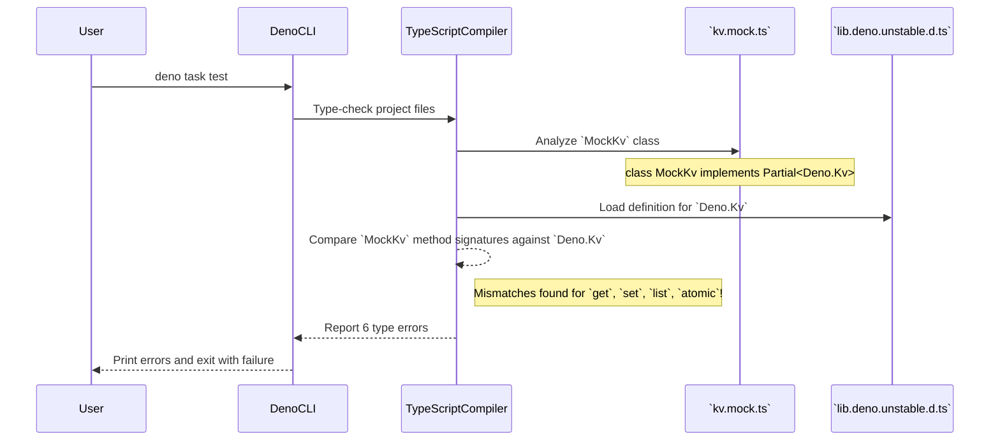

# Bug Analysis Report: TypeScript Errors in Mock Deno KV Implementation

## 1. Executive Summary

The analysis of the `deno task test` failure reveals a series of TypeScript
type-checking errors, all originating from the newly created mock file
`test/mocks/kv.mock.ts`. The root cause is a significant discrepancy between the
method signatures and return types implemented in the `MockKv` class and the
official type definitions for `Deno.Kv` and its related interfaces (e.g.,
`Deno.KvEntryMaybe`, `Deno.KvListIterator`, `Deno.AtomicOperation`).

The mock implementation, intended to fulfill "Phase 1" of the testing plan, does
not correctly adhere to the contracts defined by Deno's unstable KV API. This
results in 6 distinct compilation errors that prevent the test suite from
running. The key areas of mismatch are in the `get`, `set`, `list`, and `atomic`
methods.

## 2. Bug Description and Context (from `User Task`)

- **Observed Behavior:** Running `deno task test` fails with 6 TypeScript errors
  (TS2416, TS2322, TS2339) related to type incompatibilities in
  `test/mocks/kv.mock.ts`.
- **Expected Behavior:** The `deno task test` command should execute without any
  TypeScript errors, allowing the test suite to run.
- **Steps to Reproduce (STR):**
  1. Implement the `MockKv` class in `test/mocks/kv.mock.ts` as per the provided
     file structure.
  2. Run the command `deno task test`.
- **Environment (if provided):** Deno v2.x (inferred from `ci.yml`).
- **Error Messages (if any):**
  ```
  TS2416 [ERROR]: Property 'get' in type 'MockKv' is not assignable to the same property in base type 'Partial<Kv>'.
    Type '<T>(key: KvKey) => Promise<KvEntry<T>>' is not assignable to type '<T = unknown>(key: KvKey, options?: { consistency?: KvConsistencyLevel | undefined; } | undefined) => Promise<KvEntryMaybe<T>>'.
    ...
    at file:///.../test/mocks/kv.mock.ts:44:3

  TS2322 [ERROR]: Type 'Promise<{ key: KvKey; value: any; versionstamp: string | null; }>' is not assignable to type 'Promise<KvEntry<T>>'.
    ...
    at file:///.../test/mocks/kv.mock.ts:46:5

  TS2416 [ERROR]: Property 'set' in type 'MockKv' is not assignable to the same property in base type 'Partial<Kv>'.
    Type '(key: KvKey, value: any) => Promise<{ ok: boolean; versionstamp: string; }>' is not assignable to type '(key: KvKey, value: unknown, options?: { expireIn?: number | undefined; } | undefined) => Promise<KvCommitResult>'.
    ...
    at file:///.../test/mocks/kv.mock.ts:53:3

  TS2416 [ERROR]: Property 'list' in type 'MockKv' is not assignable to the same property in base type 'Partial<Kv>'.
    Type '<T>(selector: KvListSelector) => AsyncIterableIterator<KvEntry<T>>' is not assignable to type '<T = unknown>(selector: KvListSelector, options?: KvListOptions | undefined) => KvListIterator<T>'.
    Property 'cursor' is missing in type 'AsyncIterableIterator<KvEntry<T>>' but required in type 'KvListIterator<T>'.
    at file:///.../test/mocks/kv.mock.ts:63:10

  TS2339 [ERROR]: Property 'prefix' does not exist on type 'KvListSelector'.
    Property 'prefix' does not exist on type '{ start: KvKey; end: KvKey; }'.
    const prefix = keyToString(selector.prefix);
                                        ~~~~~~
    at file:///.../test/mocks/kv.mock.ts:66:41

  TS2416 [ERROR]: Property 'atomic' in type 'MockKv' is not assignable to the same property in base type 'Partial<Kv>'.
    Type '() => MockAtomic' is not assignable to type '() => AtomicOperation'.
    Type 'MockAtomic' is missing the following properties from type 'AtomicOperation': check, mutate, sum, min, and 2 more.
    at file:///.../test/mocks/kv.mock.ts:75:3
  ```

## 3. Code Execution Path Analysis

The issue occurs during the static analysis (type-checking) phase of the
`deno test` command, before any tests are actually executed.



The "execution path" is the compiler's attempt to validate that `MockKv` is a
valid partial implementation of `Deno.Kv`. It fails because the method
signatures, return types, and associated class implementations in `kv.mock.ts`
do not conform to the contracts defined in Deno's core type library.

## 4. Potential Root Causes and Hypotheses

### 4.1. Hypothesis 1: Incorrect Mock Implementation Against Deno KV API

This is the definitive root cause, supported by all 6 TypeScript errors. The
`MockKv` class and its helper `MockAtomic` class in `test/mocks/kv.mock.ts` do
not correctly implement the `Deno.Kv` interface. The Deno KV API has evolved to
use more specific and complex types, and the mock has not been implemented to
match them.

- **Rationale/Evidence:** Each error message explicitly states a type mismatch
  between the mock implementation and the base `Deno.Kv` type.

- **Breakdown of Mismatches:**

  1. **`get` Method (Errors TS2416, TS2322):**
     - **Problem:** The mock returns a `Promise<Deno.KvEntry<T>>` where `T` can
       be `null`. The real API expects a `Promise<Deno.KvEntryMaybe<T>>`.
       `KvEntryMaybe<T>` is a type that properly handles a non-existent key
       (where `value` and `versionstamp` are both `null`). The mock's return
       type for a non-found key (`{..., value: null, versionstamp: null}`)
       incorrectly clashes with the `Deno.KvEntry<T>` type which expects
       `versionstamp: string`.
     - **Code:**
       ```typescript
       // test/mocks/kv.mock.ts:44
       get<T>(key: Deno.KvKey): Promise<Deno.KvEntry<T>> { // Incorrect return type
         const value = this.store.get(keyToString(key));
         return Promise.resolve({
           key,
           value: value ?? null,
           versionstamp: value ? "mock-versionstamp" : null, // `null` is not assignable to `versionstamp: string`
         });
       }
       ```

  2. **`set` Method (Error TS2416):**
     - **Problem:** The mock's return type is `Promise<{ ok: boolean; ... }>`.
       The real API's `KvCommitResult` type requires the `ok` property to be the
       literal type `true`, not the broader `boolean` type.
     - **Code:**
       ```typescript
       // test/mocks/kv.mock.ts:53
       set(key: Deno.KvKey, value: any): Promise<{ ok: boolean; versionstamp: string }> { // `ok: boolean` is too wide
         this.store.set(keyToString(key), value);
         return Promise.resolve({ ok: true, versionstamp: "mock-versionstamp" });
       }
       ```

  3. **`list` Method (Errors TS2416, TS2339):**
     - **Problem 1:** The mock returns a standard `AsyncIterableIterator`, but
       the real API returns a `KvListIterator`, which is an object that is both
       an async iterator _and_ has a `cursor: string` property for pagination.
       The mock is missing this property.
     - **Problem 2:** The implementation naively assumes the `selector` argument
       will always have a `.prefix` property (`selector.prefix`). The
       `KvListSelector` type is a union, and it can be an object with `start`
       and `end` keys instead. The code does not handle this case, leading to a
       type error.
     - **Code:**
       ```typescript
       // test/mocks/kv.mock.ts:63
       async *list<T>( // This returns a plain AsyncIterableIterator, not a KvListIterator
         selector: Deno.KvListSelector,
       ): AsyncIterableIterator<Deno.KvEntry<T>> {
         const prefix = keyToString(selector.prefix); // Fails if selector is { start, end }
         // ...
       }
       ```

  4. **`atomic` Method (Error TS2416):**
     - **Problem:** The `atomic()` method returns an instance of `MockAtomic`.
       This custom class is missing several methods required by the
       `Deno.AtomicOperation` interface, such as `check`, `mutate`, `sum`,
       `min`, `max`, and `enqueue`.
     - **Code:**
       ```typescript
       // test/mocks/kv.mock.ts:75
       atomic() {
         return new MockAtomic(this.store); // MockAtomic is not a valid AtomicOperation
       }
       ```

### 4.2. Most Likely Cause(s)

Hypothesis 1 is confirmed by the compiler output. The implementation in
`test/mocks/kv.mock.ts` is a partial, type-incompatible mock of the Deno KV API.

## 5. Supporting Evidence from Code

The primary evidence is the file `test/mocks/kv.mock.ts` itself, when compared
against the type definitions for `Deno.Kv` (which can be inspected in an IDE
like VSCode by using "Go to Definition" on `Deno.Kv`). The code snippets in
section 4.1 highlight the exact lines where the implementations diverge from the
required types.

## 6. Recommended Steps for Debugging and Verification

The only path to resolution is to correct the types in `test/mocks/kv.mock.ts`
to align with the `Deno.Kv` interface.

- **General:** Use your IDE's "Go to Definition" feature on `Deno.Kv` and its
  method return types to see the exact definitions you need to implement.

- **For `get` method:**
  1. Change the method signature to return `Promise<Deno.KvEntryMaybe<T>>`.
  2. When a key is not found, ensure the returned object is
     `{ key, value: null, versionstamp: null }`.
  3. When a key is found, the returned object
     `{ key, value, versionstamp: "..." }` will correctly fit the
     `Deno.KvEntry<T>` part of the `KvEntryMaybe<T>` union type.

- **For `set` method:**
  1. Change the method signature to return `Promise<Deno.KvCommitResult>`.
  2. The implementation can remain the same, as
     `{ ok: true, versionstamp: "..." }` is assignable to `Deno.KvCommitResult`.
     The fix is in the signature's declared return type.

- **For `list` method:**
  1. **Selector Handling:** First, fix the logic to handle different selector
     types. Use a type guard like `if ("prefix" in selector)` to safely access
     the property.
  2. **Return Type:** The `async *` generator function needs to be wrapped or
     replaced. A simple fix is to not use a generator, but to return an object
     that implements the `AsyncIterator` protocol and also has a `cursor`
     property.
     ```typescript
     // A conceptual fix for the list method
     list<T>(selector: Deno.KvListSelector, _options?: Deno.KvListOptions): Deno.KvListIterator<T> {
         const entries: Deno.KvEntry<T>[] = [];
         // ... (logic to populate entries from this.store based on selector) ...
         
         let index = 0;
         const iterator: Deno.KvListIterator<T> = {
             [Symbol.asyncIterator]() { return this; },
             next: () => {
                 if (index < entries.length) {
                     return Promise.resolve({ done: false, value: entries[index++] });
                 }
                 return Promise.resolve({ done: true, value: undefined });
             },
             get cursor() {
                 // For a simple mock, returning an empty string is often sufficient.
                 return ""; 
             }
         };
         return iterator;
     }
     ```

- **For `atomic` method:**
  1. The `MockAtomic` class must implement `Deno.AtomicOperation`.
  2. Add the missing methods (`check`, `mutate`, `sum`, `min`, `max`,
     `enqueue`). For now, they can simply throw a `new Error("Not implemented")`
     if they are not used by your current tests. This will satisfy the
     type-checker.
     ```typescript
     // In MockAtomic class
     check(..._checks: Deno.AtomicCheck[]): this {
         // For a simple mock, this can do nothing or throw.
         return this;
     }
     mutate(..._mutations: Deno.KvMutation[]): this {
         throw new Error("MockAtomic.mutate() is not implemented.");
     }
     // ... implement other methods similarly
     ```

## 7. Bug Impact Assessment

The impact is **High**. These type errors completely block the execution of the
entire test suite. This prevents developers from validating their changes,
defeats the purpose of the CI pipeline, and halts progress on the testing
improvement plan (`plan_google_tests2_2.md`). Without a working test suite, the
risk of introducing regressions into the application is significantly increased.

## 8. Assumptions Made During Analysis

- It is assumed that the TypeScript compiler's error messages accurately reflect
  the type definitions of the Deno unstable KV API.
- The goal is to fix the existing `MockKv` implementation to be type-compliant,
  as outlined in the user's plan, rather than replacing it with a third-party
  library.

## 9. Open Questions / Areas for Further Investigation

- Does the current test suite require the advanced `atomic` operations like
  `mutate` or `sum`? If not, stubbing them by throwing an error is sufficient.
  If yes, their mock logic will need to be implemented.
- For the `list` method, is pagination (and therefore a functional `cursor`)
  required for any tests? If not, returning a static empty string for the cursor
  is an acceptable mock.
