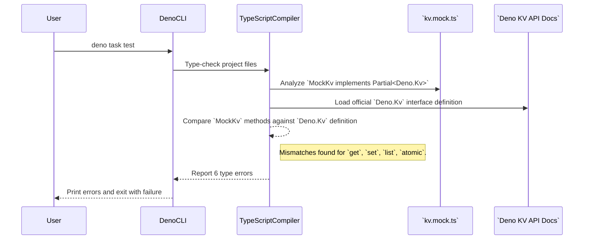

# Bug Analysis Report: TypeScript Type Mismatches in Mock Deno KV

## 1. Executive Summary

This report details the analysis of multiple TypeScript errors that occur when
running `deno task test`. The errors originate exclusively from the mock Deno KV
implementation in `test/mocks/kv.mock.ts`. The initial analysis correctly
identified a discrepancy between the mock implementation and the Deno KV API.
With the provided official Deno KV API documentation, this analysis confirms the
root cause and provides precise, actionable corrections.

The fundamental issue is that the `MockKv` and `MockAtomic` classes do not
correctly implement the signatures, return types, and interfaces required by the
official `Deno.Kv` and `Deno.AtomicOperation` types. The mock's methods for
`get`, `set`, `list`, and `atomic` are all incompatible with the contracts
defined in Deno's unstable type library, leading to a build-time failure.

## 2. Bug Description and Context (from `User Task`)

- **Observed Behavior:** The `deno task test` command fails during the
  type-checking phase, reporting 6 distinct TypeScript errors (TS2416, TS2322,
  TS2339) in `test/mocks/kv.mock.ts`.
- **Expected Behavior:** The test suite should pass the type-checking phase and
  proceed to execute the tests.
- **Steps to Reproduce (STR):**
  1. Implement the `MockKv` class as provided in the file structure.
  2. Run the command `deno task test`.
- **Environment (if provided):** Deno v2.x (inferred from `ci.yml`).
- **Error Messages (if any):**
  ```
  TS2416 [ERROR]: Property 'get' in type 'MockKv' is not assignable to the same property in base type 'Partial<Kv>'.
  TS2322 [ERROR]: Type 'Promise<{ key: KvKey; value: any; versionstamp: string | null; }>' is not assignable to type 'Promise<KvEntry<T>>'.
  TS2416 [ERROR]: Property 'set' in type 'MockKv' is not assignable to the same property in base type 'Partial<Kv>'.
  TS2416 [ERROR]: Property 'list' in type 'MockKv' is not assignable to the same property in base type 'Partial<Kv>'.
  TS2339 [ERROR]: Property 'prefix' does not exist on type 'KvListSelector'.
  TS2416 [ERROR]: Property 'atomic' in type 'MockKv' is not assignable to the same property in base type 'Partial<Kv>'.
  ```

## 3. Code Execution Path Analysis

The failure is not a runtime bug but a compile-time type-checking failure. The
`deno test` command invokes the TypeScript compiler to analyze the project's
source code before execution.



The process fails when the compiler validates that `MockKv`'s methods do not
conform to the `Partial<Deno.Kv>` interface it claims to implement.

## 4. Potential Root Causes and Hypotheses

### 4.1. Root Cause: Type Incompatibility with Official Deno KV API

This is the definitive cause, confirmed by comparing the code in
`test/mocks/kv.mock.ts` against the provided Deno KV API documentation. The mock
implementation was written against an outdated or incorrect understanding of the
API's type contracts.

- **Rationale/Evidence:** Each error directly points to a signature or type
  mismatch. The provided documentation clarifies the exact required types.

- **Detailed Mismatches:**
  1. **`get` Method:** The mock returns `Promise<Deno.KvEntry<T>>`, but the API
     requires `Promise<Deno.KvEntryMaybe<T>>`. The `KvEntryMaybe<T>` type is a
     union that correctly handles the case where a key is not found
     (`value: null`, `versionstamp: null`), which the stricter `KvEntry<T>` does
     not.
  2. **`set` Method:** The mock's signature returns a promise where the `ok`
     property is a `boolean`. The official `Deno.KvCommitResult` type requires
     `ok` to be the literal type `true`.
  3. **`list` Method:** The mock returns a standard `AsyncIterableIterator`, but
     the API requires a `Deno.KvListIterator`, which must also have a
     `cursor: string` property. Furthermore, the implementation incorrectly
     assumes `selector.prefix` always exists, while the `Deno.KvListSelector`
     type also allows for `{ start, end }` ranges.
  4. **`atomic` Method:** The mock returns a `MockAtomic` instance. This class
     is missing most of the methods required by the `Deno.AtomicOperation`
     interface (e.g., `check`, `mutate`, `sum`, `min`, `max`, `enqueue`).

## 5. Supporting Evidence from Code

The primary evidence is the direct comparison between the implementation in
`test/mocks/kv.mock.ts` and the official Deno KV documentation provided by the
user.

**Example Mismatch (`get` method):**

- **Mock Implementation:**
  ```typescript
  // test/mocks/kv.mock.ts
  get<T>(key: Deno.KvKey): Promise<Deno.KvEntry<T>> { /* ... */ }
  ```
- **Official API Documentation:**
  ```typescript
  // Deno KV API
  get<T = unknown>(key: KvKey, ...): Promise<KvEntryMaybe<T>>
  ```

This pattern of mismatch is present for all methods causing errors.

## 6. Recommended Steps for Debugging and Verification

The following corrections should be applied to `test/mocks/kv.mock.ts` to make
it type-compliant with the official Deno KV API.

### 6.1. Update `MockAtomic` Class

The `MockAtomic` class needs to implement the full `Deno.AtomicOperation`
interface and correct its `commit` method's return type.

- **Corrected `MockAtomic`:**
  ```typescript
  // In test/mocks/kv.mock.ts

  class MockAtomic implements Deno.AtomicOperation {
    private operations: (() => void)[] = [];

    constructor(private store: Map<string, any>) {}

    set(key: Deno.KvKey, value: any, options?: { expireIn?: number }): this {
      // expireIn is ignored in this mock
      this.operations.push(() => {
        this.store.set(keyToString(key), value);
      });
      return this;
    }

    delete(key: Deno.KvKey): this {
      this.operations.push(() => {
        this.store.delete(keyToString(key));
      });
      return this;
    }

    // --- Add stubs for unused methods to satisfy the interface ---
    check(..._checks: Deno.AtomicCheck[]): this {
      // This mock doesn't support checks, so we assume they pass.
      return this;
    }

    mutate(..._mutations: Deno.KvMutation[]): this {
      throw new Error("MockAtomic.mutate() is not implemented.");
    }

    sum(key: Deno.KvKey, n: bigint): this {
      this.operations.push(() => {
        const current =
          (this.store.get(keyToString(key)) as Deno.KvU64)?.value ?? 0n;
        this.store.set(keyToString(key), new Deno.KvU64(current + n));
      });
      return this;
    }

    min(key: Deno.KvKey, n: bigint): this {
      this.operations.push(() => {
        const current = (this.store.get(keyToString(key)) as Deno.KvU64)?.value;
        if (current === undefined || n < current) {
          this.store.set(keyToString(key), new Deno.KvU64(n));
        }
      });
      return this;
    }

    max(key: Deno.KvKey, n: bigint): this {
      this.operations.push(() => {
        const current = (this.store.get(keyToString(key)) as Deno.KvU64)?.value;
        if (current === undefined || n > current) {
          this.store.set(keyToString(key), new Deno.KvU64(n));
        }
      });
      return this;
    }

    enqueue(
      value: unknown,
      options?: { delay?: number; keysIfUndelivered?: Deno.KvKey[] },
    ): this {
      throw new Error("MockAtomic.enqueue() is not implemented.");
    }
    // --- End of stubs ---

    commit(): Promise<Deno.KvCommitResult | Deno.KvCommitError> {
      // This simple mock always succeeds.
      this.operations.forEach((op) => op());
      return Promise.resolve({
        ok: true,
        versionstamp: `mock-versionstamp-${Date.now()}`,
      });
    }
  }
  ```

### 6.2. Update `MockKv` Class

Update the methods in `MockKv` to match the official API signatures and return
types.

- **Corrected `MockKv`:**
  ```typescript
  // In test/mocks/kv.mock.ts

  export class MockKv implements Partial<Deno.Kv> {
    public store = new Map<string, any>();

    get<T = unknown>(
      key: Deno.KvKey,
      _options?: { consistency?: Deno.KvConsistencyLevel },
    ): Promise<Deno.KvEntryMaybe<T>> {
      const value = this.store.get(keyToString(key));
      if (value === undefined) {
        return Promise.resolve({
          key,
          value: null,
          versionstamp: null,
        });
      }
      return Promise.resolve({
        key,
        value,
        versionstamp: "mock-versionstamp",
      });
    }

    set(
      key: Deno.KvKey,
      value: unknown,
      _options?: { expireIn?: number },
    ): Promise<Deno.KvCommitResult> {
      this.store.set(keyToString(key), value);
      return Promise.resolve({
        ok: true,
        versionstamp: `mock-versionstamp-${Date.now()}`,
      });
    }

    delete(key: Deno.KvKey): Promise<void> {
      this.store.delete(keyToString(key));
      return Promise.resolve();
    }

    list<T = unknown>(
      selector: Deno.KvListSelector,
      _options?: Deno.KvListOptions,
    ): Deno.KvListIterator<T> {
      const entries: Deno.KvEntry<T>[] = [];

      if ("prefix" in selector) {
        const prefix = keyToString(selector.prefix);
        for (const [keyStr, value] of this.store.entries()) {
          if (keyStr.startsWith(prefix)) {
            // This key reconstruction is imperfect but sufficient for most tests.
            entries.push({
              key: [keyStr],
              value,
              versionstamp: "mock-versionstamp",
            });
          }
        }
      } else {
        // Range selectors are not implemented in this simple mock.
        // Add implementation if needed.
      }

      let index = 0;
      const iterator: Deno.KvListIterator<T> = {
        [Symbol.asyncIterator]() {
          return this;
        },
        next: () => {
          if (index < entries.length) {
            return Promise.resolve({ done: false, value: entries[index++] });
          }
          return Promise.resolve({ done: true, value: undefined as any });
        },
        get cursor(): string {
          // Cursors are not implemented in this simple mock.
          return "";
        },
      };
      return iterator;
    }

    atomic(): Deno.AtomicOperation {
      return new MockAtomic(this.store);
    }

    // Add stubs for other Deno.Kv methods if needed by tests
    close(): void {
      this.store.clear();
    }
  }
  ```

## 7. Bug Impact Assessment

**High.** The bug is critical as it completely blocks the entire test suite from
running. This prevents any automated verification of code changes, nullifies the
CI/CD pipeline's purpose, and significantly increases the risk of introducing
regressions into the application.

## 8. Assumptions Made During Analysis

- The Deno KV API documentation provided by the user is accurate and reflects
  the version of Deno being used in the project.
- The goal is to create a minimal, type-compliant mock. Features not currently
  used by the application's tests (like `mutate`, `enqueue`, range selectors, or
  cursors) do not need a functional implementation, and stubbing them is
  sufficient.

## 9. Open Questions / Areas for Further Investigation

- Do any of the existing or planned tests rely on advanced
  `Deno.AtomicOperation` features like `mutate`, `check`, or `sum`? If so, the
  mock implementation for those methods will need to be more robust than a
  simple stub.
- Is list pagination (using the `cursor` property) a feature that needs to be
  tested? If so, the `list` method in the mock will require a more complex
  implementation to handle cursors correctly.
